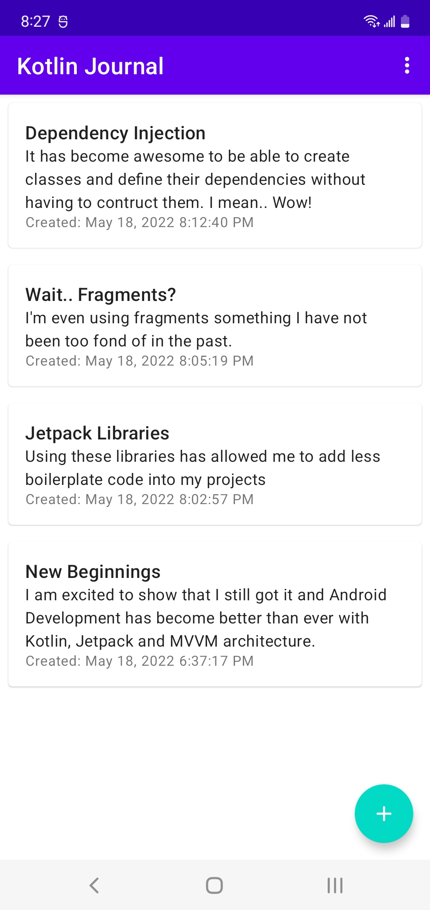
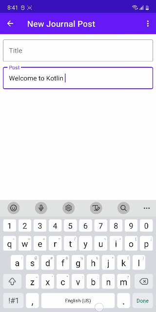
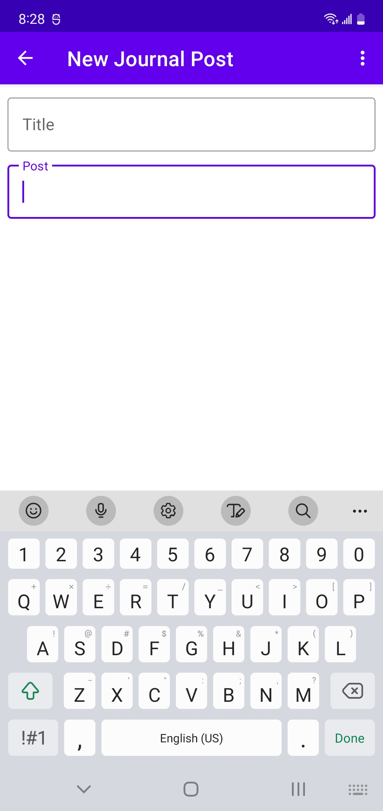

Kotlin Journal
=================

A journal app built with Kotlin, Android Jetpack and MVVM architecture.

Libraries Used
--------------
* View Binding
* Lifecycles
* LiveData
* Navigation Component
* Room
* ViewModel
* Fragment
* Dagger Hilt - Dependency Injection
* Kotlin Coroutines
* Material Design

Screenshots
-----------

  
  
  

